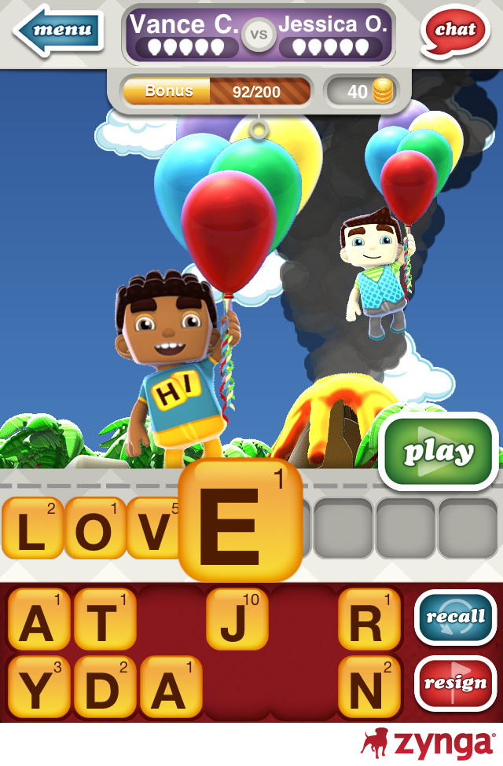
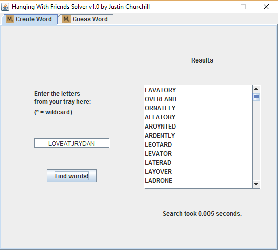
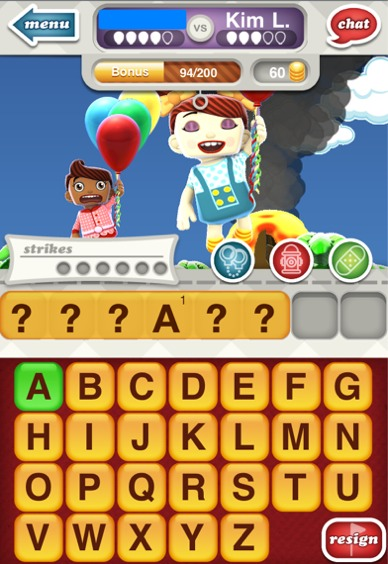
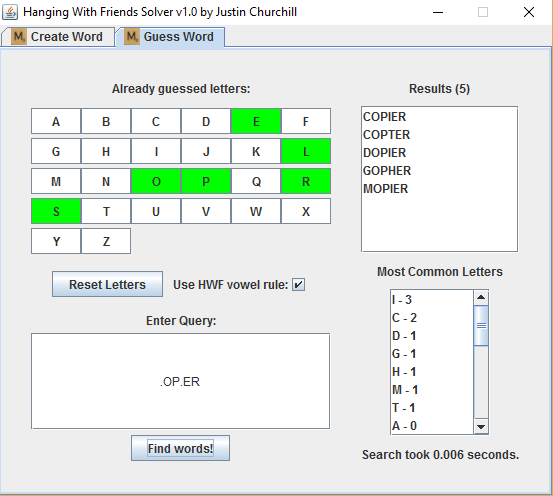

# hanging_with_friends_solver
Solver for the once popular phone game "hanging with friends"

Java implementation; compile to a jar file and execute under the JRE.

## Solver

In this game, two players face off. Each crafts a word from their limited set of tiles for the other person to guess.

When faced with this, it's best to make the hardest possible word for your friend. This solver doesn't attempt to define "hardest", but it does display a list of all possible words that can be created from the letters provided, ordered by length descending.

Then, you must guess your opponent's word. With each guess, you are told which letters you got correct, and you may use the solver to continuously search for possible answers as you gain more information.

The solver will do the work of eliminating impossible words based on the known constraints (length of word, letters you know, letters you've guessed).

